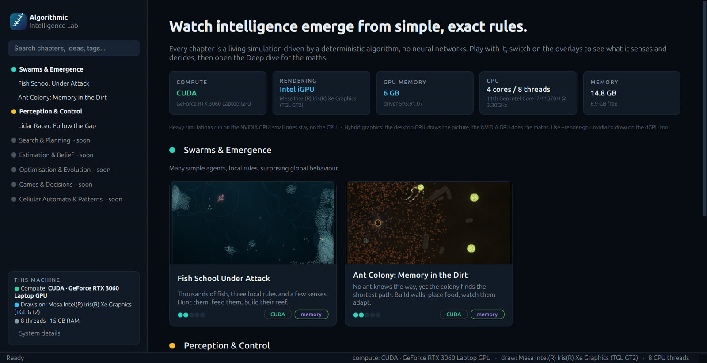
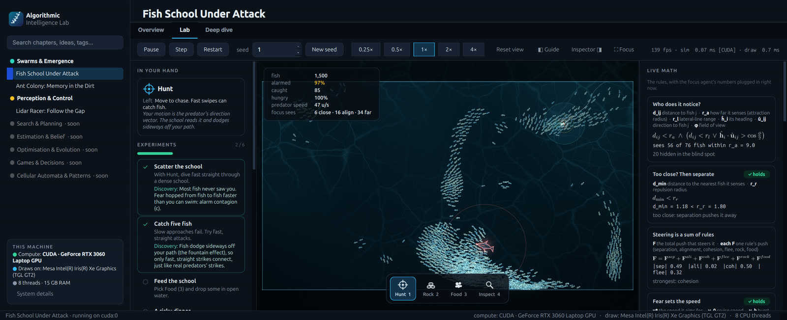
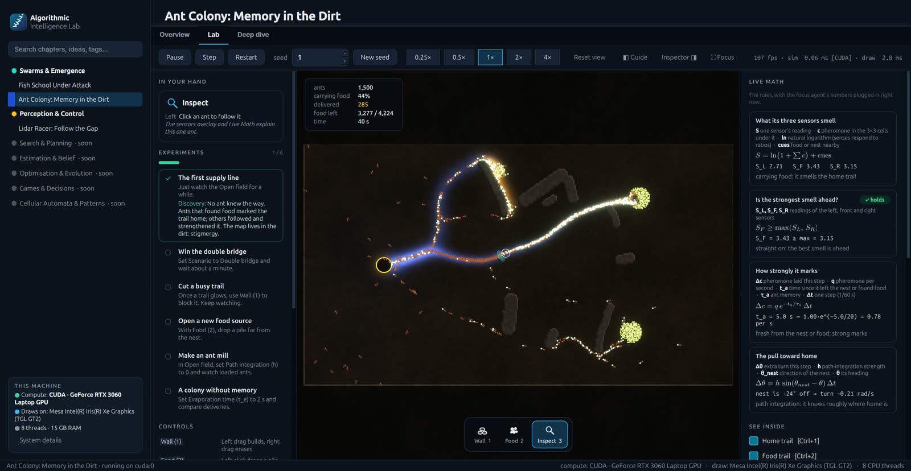
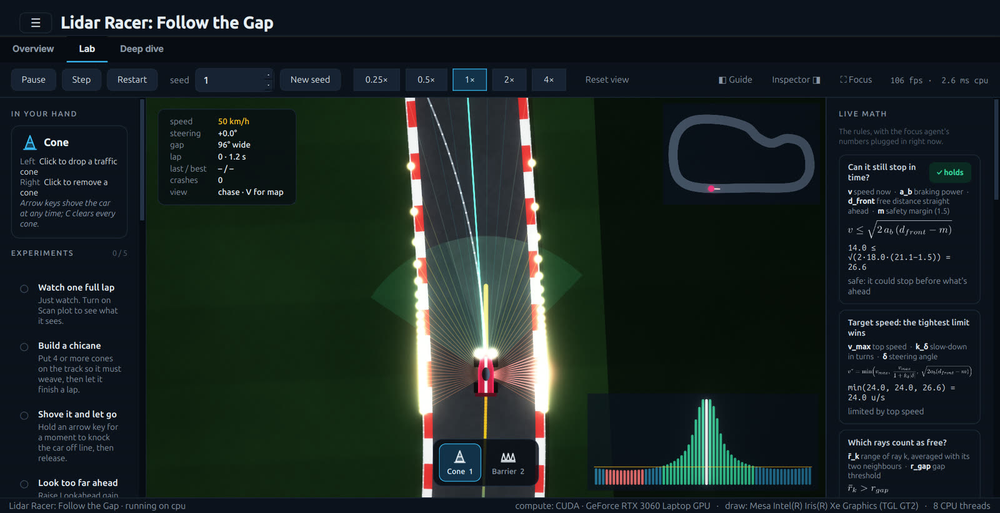

# Algorithmic Intelligence Lab

**Watch intelligence emerge from simple, exact rules.**

A native desktop app (Linux and Windows) for learning *deterministic* intelligent
algorithms (no neural networks) by playing with them. Every chapter is a live simulation
you build in, disturb and inspect with the mouse and keyboard. Overlays show what the
algorithm senses and decides, **Live Math** shows its equations with the numbers it is
using right now, and a three-level Deep dive (Intuition, The Math, Research) explains it
for high-school students and researchers alike.



| Fish school (you are the predator) | Ant colony (stigmergy) | Lidar racer (Follow-the-Gap) |
|---|---|---|
|  |  |  |

## Install and run

You need [uv](https://docs.astral.sh/uv/) (it fetches the right Python by itself) and
[git](https://git-scm.com/). A GPU is optional.

**Ubuntu / Linux**

```bash
curl -LsSf https://astral.sh/uv/install.sh | sh
git clone https://github.com/<you>/algorithmic-intelligence-lab.git
cd algorithmic-intelligence-lab
uv run ailab
./tools/install_desktop.sh          # optional: add it to your app launcher
```

**Windows 10/11** (PowerShell)

```powershell
powershell -ExecutionPolicy ByPass -c "irm https://astral.sh/uv/install.ps1 | iex"
git clone https://github.com/<you>/algorithmic-intelligence-lab.git
cd algorithmic-intelligence-lab
uv run ailab
powershell -ExecutionPolicy Bypass -File tools\install_shortcut.ps1   # optional: Start menu
```

The first `uv run` downloads the dependencies (a few hundred MB, mostly Qt and Warp).
Requirements: OpenGL 3.3 (any GPU or driver from the last decade). An NVIDIA GPU is used
automatically through CUDA; otherwise everything runs on the CPU with smaller agent
counts. Equations are typeset by LaTeX when a TeX install is present (TeX Live, MiKTeX)
and by a built-in renderer otherwise, so nothing extra is needed. macOS should work on
the CPU path but is only checked in CI.

```bash
uv run ailab --sysinfo                              # what your machine brings
uv run ailab --list                                 # all chapters
uv run ailab --chapter swarms.fish-school           # open one directly
uv run ailab --device cpu                           # force the CPU backend
uv run ailab --render-gpu nvidia                    # Linux hybrid laptops: draw on the dGPU
```

## The Lab

- **Tools** on a hotbar (keys 1–9): hunt the fish, build rock and walls, drop food, lay
  cones, inspect one agent. Each chapter declares its own.
- **Guide** (left): the tool in your hand, **experiments** that tick themselves off when
  you manage them (each reveals the idea behind it), the controls, and a **Model vs.
  nature** note on what the simulation simplifies.
- **Inspector** (right): **Live Math** (the rules with the focus agent's numbers plugged
  in, with a ✓ when a condition holds; every symbol is defined above its equation), the
  overlays (Ctrl+1–9) and every parameter. Hover any parameter for what it does.
- **Focus mode** (Tab): only the simulation, nothing else. F11 for full screen. Both side
  panels can be resized or hidden.
- **Responsive like a web page**: the window fits the screen it opens on; on narrower
  windows the chapter list becomes a ☰ drawer, the Guide and Inspector slide over the
  view, the toolbar sheds secondary controls, and cards reflow.
- **Chase camera** (racer): the view rides with the car and turns with it, so the arrow
  keys match the screen. V switches to the whole track.

## System-aware by design

Every launch probes the machine (CPU, RAM, every GPU, NVIDIA driver and CUDA, which GPU
draws the window, and TeX) and shows the results in a startup system check, on the home
page and in the sidebar. Heavy chapters run on the GPU through CUDA, and light ones stay on
the CPU. On a CPU-only machine, agent counts scale down automatically. On hybrid laptops
the iGPU usually draws while the dGPU computes, and the app shows you which is which.

## What is inside

| Layer | Choice | Why |
|---|---|---|
| UI | Qt 6 (PySide6 Essentials), native widgets | Native on Linux (Wayland/X11) and Windows |
| Compute | NVIDIA Warp | One kernel source runs on CUDA **or** CPU |
| Rendering | ModernGL: SDF shapes, 4× MSAA, HDR bloom, procedural backgrounds | Crisp at any zoom, and it looks good |
| Maths text | Markdown + LaTeX → SVG (cached), ziamath fallback | Typeset equations with or without TeX |
| Exact maths | SymPy in the test suite | Every equation shown is checked against the code |
| Explainer videos | Manim Community Edition (optional) | Deep-dive animations |

### Determinism

Same seed + same input ⇒ the same run, bit for bit, on a given device. Simulations use a
fixed time step, seeded random numbers, double-buffered GPU kernels and integer atomics
(float atomics would make results depend on thread timing). `tests/test_chapter_contract.py`
enforces this for **every** chapter automatically.

### Memory systems

Algorithms that need memory use one of three shared kinds (`ailab/core/memory.py`):

- **Environmental memory** (`FieldMemory`): written into the world, evaporates and diffuses.
  Ant pheromones, a car's occupancy map.
- **Working memory** (`forget`): a belief held by one agent that fades over time, e.g. a
  fish remembering where it last saw the predator.
- **Episodic trace** (`TraceMemory`): a ring buffer of recent observations, e.g. trails.

## Repository layout

```
ailab/                 the engine (never chapter-specific)
  core/                simulation contract, params/tools/experiments, clock, memory,
                       sandbox kit (walls, rock), system probe, catalogue, paths
  render/              Scene API (numpy) + ModernGL renderer + shaders
  text/                markdown + LaTeX
  app/                 Qt application (boot check, main window, viewport, Lab panels)
chapters/
  tracks.toml          curriculum tracks (order, colour)
  <track>/<slug>/      one self-contained chapter: chapter.toml, sim.py, intro.md,
                       advanced.md, tests/, media/ (optional Manim scenes)
templates/chapter/     what `tools/new_chapter.py` copies
tests/                 engine tests + the per-chapter contract
docs/                  roadmap, images
```

Chapters are discovered from `chapter.toml` only, and their code is imported the first
time a chapter is opened, so the catalogue scales to hundreds of chapters.

## Contributing a chapter

See [CONTRIBUTING.md](CONTRIBUTING.md). In short:

```bash
uv run tools/new_chapter.py planning a-star "A*: The Shortest Path"
uv run ailab --chapter planning.a-star
uv run pytest chapters/planning/a-star tests
```

## License

MIT. See [LICENSE](LICENSE).
